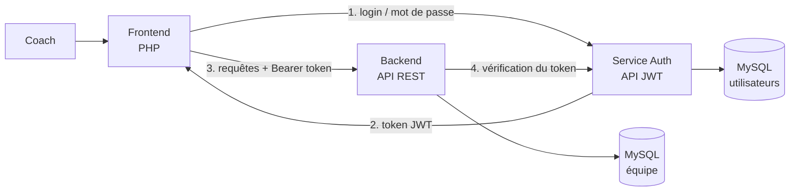

# Gestion d'équipe e-sport

Application web permettant à un coach de gérer son équipe e-sport (postes de League of Legends) : joueurs, matchs, compositions d'équipe, évaluations et statistiques.

Projet réalisé en binôme dans le cadre du module R4.01 du BUT Informatique à l'IUT Paul Sabatier (Toulouse III). L'application est découpée en **trois services indépendants** qui communiquent via des API REST et une authentification JWT.

## Démo en ligne

| Service | URL |
|---|---|
| Application | https://frontendr401.alwaysdata.net/login |
| Documentation API backend | https://r401teammanagementapi.alwaysdata.net/docs/ |
| Documentation API auth | https://r401auth.alwaysdata.net/docs/ |

Compte de démonstration : `coach` / `sport`

## Architecture

| Dossier | Rôle |
|---|---|
| [`auth/`](auth/) | Service d'authentification : vérifie les identifiants et délivre / valide les tokens JWT |
| [`backend/`](backend/) | API REST : joueurs, commentaires, rencontres, feuilles de match, statistiques |
| [`frontend/`](frontend/) | Interface web du coach, qui consomme les deux API |

Chaque service a sa propre base de données et peut être déployé séparément.

## Fonctionnalités

- **Joueurs** : ajout, modification, suppression, recherche, statut (actif, blessé, absent, suspendu), commentaires du coach
- **Rencontres** : planification des matchs (domicile / extérieur) et saisie du résultat
- **Feuilles de match** : composition de l'équipe par poste (top, jungle, mid, ADC, support), titulaires et remplaçants
- **Évaluations** : note de performance de chaque joueur après un match
- **Tableau de bord** : statistiques d'équipe (victoires, nuls, défaites) et par joueur (titularisations, poste le plus performant, moyenne des évaluations, matchs consécutifs)

## Stack technique

| Élément | Technologie |
|---|---|
| Langage | PHP 8.1+ (sans framework) |
| Base de données | MySQL (PDO) |
| Authentification | JWT (HS256), implémentation maison |
| Documentation API | OpenAPI 3 + Swagger UI |
| Serveur | Apache (`mod_rewrite`) |
| Hébergement | alwaysdata |

## Installation locale

Les trois services s'installent séparément, chacun dans son propre VirtualHost Apache. Les instructions détaillées sont dans le README de chaque dossier. Ordre conseillé :

1. [`auth/`](auth/README.md)
2. [`backend/`](backend/README.md)
3. [`frontend/`](frontend/README.md)

Les fichiers `.env` contenant les identifiants de base de données et le secret JWT ne sont pas versionnés.

## Compétences développées

| Domaine | Compétences |
|---|---|
| Architecture | Découpage en services indépendants, communication entre API |
| API REST | Conception des routes, codes HTTP, routeur fait maison, documentation OpenAPI / Swagger |
| Sécurité | Authentification par token JWT, échappement des sorties contre les failles XSS, protection des fichiers sensibles via `.htaccess` |
| Back-end PHP | Architecture MVC, patron DAO, Singleton, autoloader PSR-4, énumérations PHP 8 |
| Base de données | Modélisation relationnelle, requêtes préparées avec PDO |
| Déploiement | Configuration Apache, hébergement des trois services sur alwaysdata |

## Équipe

- [CUMBANE Claudio](https://github.com/claudio-narciso)
- [WACKER Luka](https://github.com/Marooneux)
